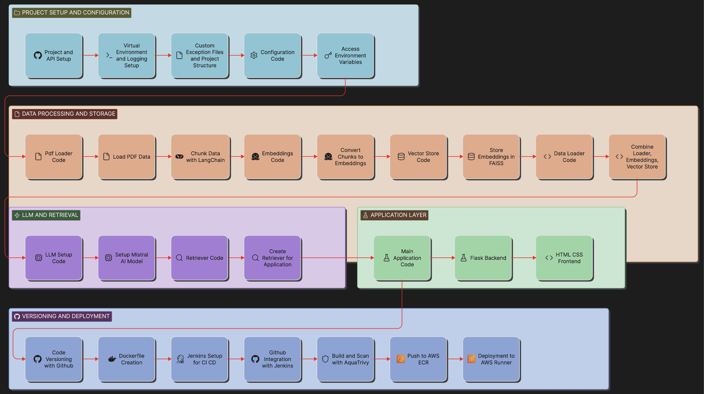

<div align="center">

# 🏥 Medical RAG Chatbot

### Retrieval-Augmented Generation for Medical Question Answering

[](https://www.python.org/)
[](https://flask.palletsprojects.com/)
[](https://www.langchain.com/)
[](https://www.docker.com/)
[](https://www.jenkins.io/)
[](https://aws.amazon.com/)
[](https://huggingface.co/)

A production-ready RAG-based medical question-answering system powered by the **Gale Encyclopedia of Medicine**, featuring semantic search with FAISS, LangChain retrieval pipelines, and a fully automated CI/CD deployment on AWS.

---

</div>

## 📑 Table of Contents

- [Overview](#-overview)
- [Architecture](#-architecture)
- [Tech Stack](#-tech-stack)
- [Project Structure](#-project-structure)
- [Getting Started](#-getting-started)
- [CI/CD Pipeline](#-cicd-pipeline)
- [How It Works](#-how-it-works)
- [Deployment](#-deployment)
- [Contributing](#-contributing)
- [License](#-license)

---

## 🔍 Overview

The Medical RAG Chatbot is an end-to-end **Retrieval-Augmented Generation** system that answers medical queries by grounding LLM responses in verified medical literature. Instead of relying solely on a language model's parametric knowledge, the system retrieves relevant passages from the **Gale Encyclopedia of Medicine** and uses them as context — producing factual, source-backed answers.

### Key Highlights

- 🧠 **RAG Architecture** — Combines retrieval and generation for grounded, factual responses
- 🔎 **Semantic Search** — FAISS vector database enables fast, meaning-aware document retrieval
- 🔗 **LangChain Pipeline** — Modular retrieval chain with custom prompt engineering
- 🤖 **Meta Llama 3 (8B Instruct)** — Hosted on Hugging Face Inference API for generation
- 🌐 **Flask Web App** — Clean, session-based chat interface
- 🐳 **Dockerized** — Fully containerized for reproducible deployments
- 🚀 **CI/CD on AWS** — Automated build, scan, push, and deploy via Jenkins

---

## 🏗 Architecture

<div align="center">



</div>

The architecture spans five layers:

| Layer | Description |
|:------|:------------|
| **Project Setup & Configuration** | Virtual environment, logging, custom exceptions, config management, and environment variables |
| **Data Processing & Storage** | PDF ingestion → text chunking (LangChain) → embedding generation → FAISS vector store creation |
| **LLM & Retrieval** | LLM setup via Hugging Face Inference API, retriever construction, and RetrievalQA chain assembly |
| **Application Layer** | Flask backend serving the chat UI, session management, and query routing |
| **Versioning & Deployment** | GitHub version control → Jenkins CI/CD → Docker build → Trivy scan → ECR push → EC2 deployment |

---

## 🛠 Tech Stack

<table>
<tr>
<td><strong>Category</strong></td>
<td><strong>Technologies</strong></td>
</tr>
<tr>
<td>Language</td>
<td>Python 3.10</td>
</tr>
<tr>
<td>LLM</td>
<td>Meta Llama 3 8B Instruct (via Hugging Face Inference API)</td>
</tr>
<tr>
<td>Embeddings</td>
<td>all-MiniLM-L6-v2 (Sentence Transformers)</td>
</tr>
<tr>
<td>Orchestration</td>
<td>LangChain, LangChain Community, LangChain Hugging Face</td>
</tr>
<tr>
<td>Vector Store</td>
<td>FAISS (faiss-cpu)</td>
</tr>
<tr>
<td>Web Framework</td>
<td>Flask</td>
</tr>
<tr>
<td>Containerization</td>
<td>Docker</td>
</tr>
<tr>
<td>CI/CD</td>
<td>Jenkins</td>
</tr>
<tr>
<td>Security Scanning</td>
<td>Trivy (Aqua Security)</td>
</tr>
<tr>
<td>Cloud</td>
<td>AWS (EC2, ECR)</td>
</tr>
<tr>
<td>Knowledge Source</td>
<td>The Gale Encyclopedia of Medicine (2nd Edition, PDF)</td>
</tr>
</table>

---

## 📂 Project Structure

```
Medical-RAG-Chatbot/
│
├── app/
│   ├── application.py              # Flask entry point & route definitions
│   ├── components/
│   │   ├── data_loader.py          # Orchestrates PDF → vectorstore pipeline
│   │   ├── pdf_loader.py           # PDF ingestion & text chunking
│   │   ├── embeddings.py           # HuggingFace embedding model initialization
│   │   ├── vectorstore.py          # FAISS vector store load/save operations
│   │   ├── llm.py                  # LLM setup via HuggingFace Inference API
│   │   └── retriever.py            # RetrievalQA chain with custom prompt
│   ├── config/
│   │   └── config.py               # Centralized configuration & constants
│   ├── common/
│   │   ├── logger.py               # Structured logging setup
│   │   └── custom_exception.py     # Custom exception handling
│   └── templates/
│       └── index.html              # Chat UI frontend
│
├── data/                           # Source PDF (Gale Encyclopedia of Medicine)
├── vectorstore/                    # Persisted FAISS index
├── custom_jenkins/
│   └── Dockerfile                  # Custom Jenkins image with Docker CLI
├── images/
│   └── architecture.png            # Architecture diagram
├── logs/                           # Application logs (date-stamped)
│
├── Dockerfile                      # Application container definition
├── Jenkinsfile                     # CI/CD pipeline definition
├── requirements.txt                # Python dependencies
├── setup.py                        # Package setup & installation
├── .env                            # Environment variables (not in VCS)
├── .gitignore
└── .dockerignore
```

---

## 🚀 Getting Started

### Prerequisites

- **Python 3.10+**
- **Hugging Face Account** with an [API token](https://huggingface.co/settings/tokens)
- **Docker** (for containerized deployment)

### 1. Clone the Repository

```bash
git clone https://github.com/Anand-Velpuri/Medical-RAG-Chatbot.git
cd Medical-RAG-Chatbot
```

### 2. Set Up the Environment

```bash
python -m venv .venv
source .venv/bin/activate        # On Windows: .venv\Scripts\activate
pip install -e .
```

### 3. Configure Environment Variables

Create a `.env` file in the project root:

```env
HF_TOKEN=your_huggingface_api_token
```

### 4. Prepare the Vector Store

Place the source PDF in the `data/` directory (the Gale Encyclopedia of Medicine PDF is expected), then run the data loader to build the FAISS index:

```bash
python -m app.components.data_loader
```

This will:
- Load and parse the PDF
- Split text into chunks (500 chars, 50 char overlap)
- Generate embeddings using `all-MiniLM-L6-v2`
- Persist the FAISS index to `vectorstore/db_faiss/`

### 5. Run the Application

```bash
python app/application.py
```

The app will be available at **http://localhost:5001**

### 6. Run with Docker

```bash
docker build -t medical-rag-chatbot .
docker run -d -p 5001:5001 --env-file .env medical-rag-chatbot
```

---

## ⚙ CI/CD Pipeline

The project includes a fully automated **Jenkins CI/CD pipeline** that handles the complete lifecycle from code push to production deployment.

### Pipeline Flow

```
GitHub  →  Jenkins  →  Docker Build  →  Trivy Scan  →  Amazon ECR  →  Amazon EC2
```

### Pipeline Stages

| Stage | Description |
|:------|:------------|
| **Clone GitHub Repo** | Pulls the latest code from the `main` branch using GitHub credentials |
| **Build, Scan & Push** | Builds the Docker image, runs a Trivy vulnerability scan (HIGH/CRITICAL), and pushes to Amazon ECR |
| **Deploy to EC2** | SSHs into the EC2 instance, pulls the latest image from ECR, and runs the container with environment variables |

### What Happens on Every Deployment

1. ✅ Latest Docker image is built from source
2. 🔒 Container is scanned for HIGH and CRITICAL vulnerabilities via **Trivy**
3. 📦 Image is tagged and pushed to **Amazon ECR**
4. 🚀 Previous container on EC2 is stopped and replaced
5. 🔐 Application secrets are injected securely via environment files

### Custom Jenkins Image

A custom Jenkins Docker image (`custom_jenkins/Dockerfile`) is provided with Docker CLI pre-installed, enabling Docker-in-Docker (DinD) workflows for building container images within Jenkins pipelines.

---

## 🧠 How It Works

```
┌─────────────┐     ┌──────────────────┐     ┌───────────────┐
│  User Query  │────▶│  FAISS Retriever  │────▶│  Top-K Chunks  │
└─────────────┘     │  (Semantic Search) │     │  (k=5)         │
                    └──────────────────┘     └───────┬───────┘
                                                      │
                                                      ▼
                                            ┌──────────────────┐
                                            │  Prompt Template  │
                                            │  (Context + Query)│
                                            └───────┬──────────┘
                                                      │
                                                      ▼
                                            ┌──────────────────┐
                                            │   Meta Llama 3    │
                                            │  (8B Instruct)    │
                                            └───────┬──────────┘
                                                      │
                                                      ▼
                                            ┌──────────────────┐
                                            │  Grounded Answer  │
                                            │  (2-3 lines)      │
                                            └──────────────────┘
```

1. **Query Input** — The user submits a medical question through the Flask chat interface
2. **Semantic Retrieval** — The query is embedded and matched against the FAISS vector store to retrieve the top 5 most relevant document chunks
3. **Prompt Construction** — Retrieved chunks are injected into a custom prompt template alongside the user's question
4. **LLM Generation** — Meta Llama 3 (8B Instruct) generates a concise 2–3 line answer grounded in the retrieved context
5. **Response Delivery** — The answer is displayed in the session-based chat interface

---

## 🌐 Deployment

The application is deployed on **Amazon EC2** using a containerized architecture:

- **Container Runtime**: Docker with `--restart always` policy for high availability
- **Port**: `5001`
- **Image Registry**: Amazon ECR (`ap-south-1` region)
- **Secrets Management**: Environment variables injected via `.env` file at runtime

> **Note:** Since the application is hosted on a personal AWS environment with limited cloud resources, source code and architecture are shared in lieu of a permanent public deployment link.

---

## 🤝 Contributing

Contributions, issues, and feature requests are welcome! Feel free to:

1. **Fork** the repository
2. **Create** a feature branch (`git checkout -b feature/amazing-feature`)
3. **Commit** your changes (`git commit -m 'Add amazing feature'`)
4. **Push** to the branch (`git push origin feature/amazing-feature`)
5. **Open** a Pull Request

---

## 📄 License

This project is open source and available for educational and research purposes.

---

<div align="center">

**Built with ❤️ by [Anand Velpuri](https://github.com/Anand-Velpuri)**

*If you found this project helpful, consider giving it a ⭐!*

</div>
